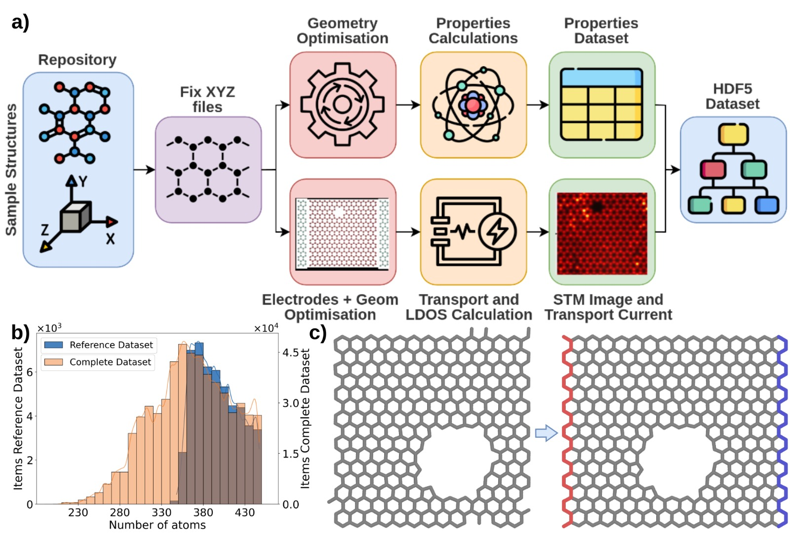
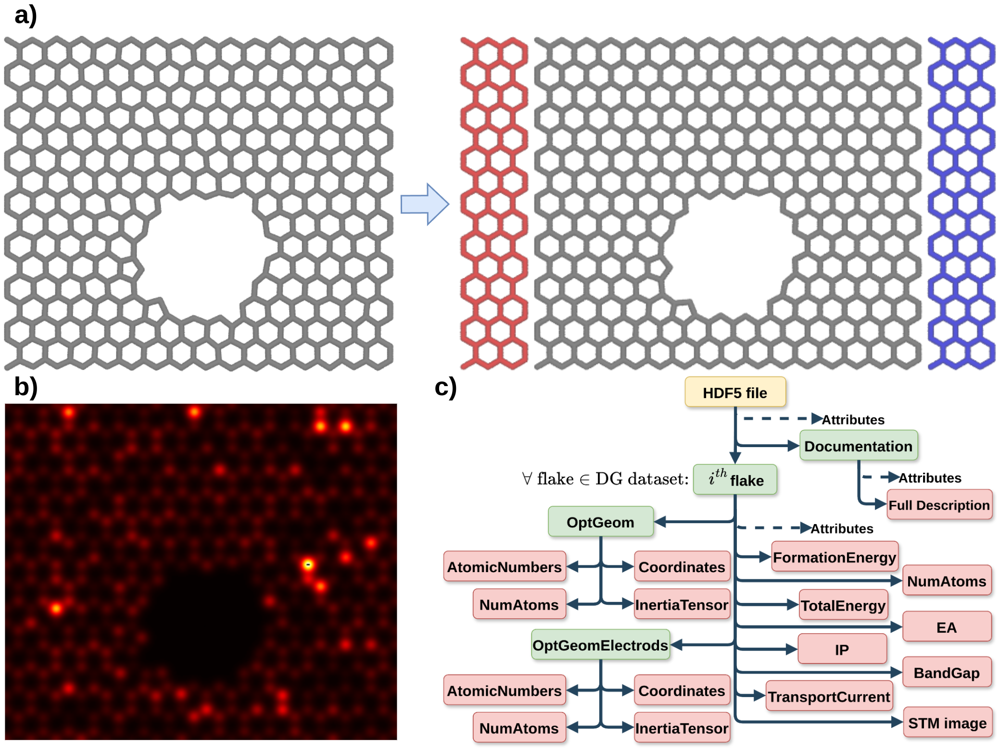

<h1 align="center">
    <br/>
  AutoDFTB 
</h1>

---

# Workflow

## Introduction
This study investigates how atomic-scale defects affect the electronic behaviour of graphene, aiming to support the design of nanoscale devices with customised properties. Building on an existing repository of defective graphene structures, a new dataset has been created using high-throughput automated workflows and Density Functional Tight Binding (DFTB) calculations using DFTB+. The dataset includes key electronic properties—such as electron affinity, ionisation potential, total energy, band gap, and Fermi energy—as well as simulated Scanning Tunnelling Microscopy (STM) images and quantum transport properties obtained via the Non-Equilibrium Green’s Function (NEGF) method. Fully FAIR-compliant, the dataset is designed to support multiscale workflows, enable comparison with experimental data, and foster AI-driven research in nanographene.

The dataset generation workflow is outlined in Fig. 1a. Atomic coordinates of graphene samples were sourced from a dataset comprising 562,217 periodic structures, each in XYZ format and containing 206 to 447 atoms. These structures share a common 2D periodicity, and their total electronic energies were computed at the DFT level using VASP.


Figure 1.: a) HDF5 dataset generation workflow, b) Distribution of the number of atoms of the reference dataset with respect to the complete initial dataset, c) Fix procedure of the original DG structures

## STEP 0: Setup environment (Suggested)
* Install miniconda
* create env with `conda create -n <env_name> python==3.10.13`
* Install the requirements `pip install  -r requirements.txt`
* Download the binary precompiled of dftb+ from `https://github.com/dftbplus/dftbplus/releases`
Ecco una versione corretta e più chiara della nota in inglese britannico:


> **NOTE:** Each step has its own configuration file to ensure modularity. When launching a specific step, remember to update the `package_path` in the corresponding config file.
For example, **Step 1** runs a Python script called `fix_xyz_dataset.py`, which uses the associated configuration file `config/fix_xyz_dataset.yml`.


## STEP 1: Fix xyz files
To ensure relevance to experimental conditions, structures with an in-plane carbon atom density of at least ~78% of pristine graphene were selected. From these, 50,000 structures were chosen for the reference dataset (see Fig. 1b). To minimise edge effects in transport simulations, the largest defect in each flake was centred, and the flake was repositioned so that the atom with the lowest x and y coordinates was at (0, 0).

As the original dataset's structures lacked the periodicity necessary to preserve graphene's aromaticity, two additional rows of carbon atoms in an armchair configuration were appended at both ends. This modification reinstates graphene’s intrinsic periodicity, which is crucial for maintaining its electronic properties—particularly in partially periodic systems used in device-level transport calculation.
This process is automatically carried out by `fix_xyz_dataset.py`.

`python fix_xyz_dataset.py`

> **NOTE:** This process works without DFTB+ and only requires the installation of the packages listed in the `requirements.txt`.

## STEP 2: Geometry optimization
Now we have to optimize the geometry of the fixed flakes, obtained from the previous point. To do so we firstly get the standard cell, by manually optimizing the geometry and the lattice of a perfect graphene flakes with the same dimension of the flakes in the dataset.
Once the standard cell is known, we optimize the geometry with a fixed lattice for all the flakes in the dataset by running `auto_optimize_geometry.py`.

>**NOTE:** This workflow, starting from the geometry optimisation step, is designed to be run with SLURM, which is the typical way to manage multiple jobs on a cluster. If you wish to run it locally, simply change the scheduler option in all the files within the `config` folder, selecting one of the available options: `[local, slurm]`.

## STEP 3: DFTB Simulations
All electronic properties calculations were performed with the DFTB+ package Prior to electronic property calculations, geometry optimizations were performed to ensure stable configurations of the DG flakes. This step was crucial to minimize the total energy and remove any spurious forces acting on the atoms.

Now we can launch `auto_dftb.py` on the fixed and optimized dataset to get some target properties, in the output we have a `flake_name_NUM.json` file with the properties below:

| Property Name           | Unit              |
|-------------------------|-------------------|
| `file_name`             | —                 |
| `file_type`             | —                 |
| `n_electrons`           | — (count)         |
| `fermi_level_ev`        | eV                |
| `total_energy_eV`       | eV                |
| `total_energy_eV_-1`    | eV                |
| `total_energy_eV_+1`    | eV                |
| `IP_ev`                 | eV                |
| `EA_ev`                 | eV                |
| `band_gap_ev`           | eV                |

JSON file example:
```json
{
    "n_electrons": 714.0,
    "fermi_level_ev": -5.2408,
    "total_energy_eV": -17434.2747,
    "file_name": "graphene_1131_opt",
    "file_type": "POSCAR",
    "total_energy_eV_-1": -17439.4289,
    "total_energy_eV_+1": -17428.9339,
    "IP_ev": 5.154199999997218,
    "EA_ev": -5.340800000001764,
    "band_gap_ev": -10.494999999998981
}
```


Figure 2.: a) Procedure in which the 2 PLs are connected to the flake, the source one in red and the drain one in blue b) STM image of the flake, plotted with the hot colormap c) Structure of the HDF5 file: the groups are represented in green, while the datasets, along with their respective attributes, are represented in red.

## STEP 4: Elctrodes generator

Electron transport simulations were based on the Non-Equilibrium Green’s Function (NEGF) formalism, as
implemented in DFTB To perform NEGF calculations on the DG structures, electrodes were attached at both ends of each DG sample to model the source and drain contacts. To study the electronic transport properties, we configured each defective graphene flake as a device by connecting two electrodes. The resulting current was calculated to evaluate the conductive behavior of the material. Once the two PLs have been connected to the flakes, the geometry of the overall structures have been optimized. In this case, the atoms belonging to the PLs were kept fixed, while the atoms of the device were optimized. As in the Geometry Optimization section, the XYZ files are first converted into POSCAR files, then a `dftb_in.hsd` has been prepared for each flake with the same parameters described in the Geometry Optimization section. In this case only the convergence check is
performed at the end of the optimization run. An example of structure obtained at the end of this process with the electrodes is shown in Figure 2a.

For run this step launch `python electrodes_generator.py`
for each flake we have this file `data_path/transport` where device is the original flake and source and drain are the terminals added to the flake for run the transport current simulation in the next step.

```json
{
    "device": [
        1,
        378
    ],
    "source": [
        379,
        474
    ],
    "drain": [
        475,
        570
    ],
    "cell": [
        39.53476932,
        0.0,
        0.0,
        0.0,
        34.27629786,
        0.0,
        0.0,
        0.0,
        10.0
    ],
    "contact_vector": 7.409367073373903,
    "file_name": "graphene_67"
}
```
## STEP 5 : Transport 
Before running the transport simulation, the Fermi levels for both the source and drain contacts must be calculated. This is done by creating a new `dftb_in.hsd` file for each sample, using the previously generated `processed.gen` and the `transport.hsd` file. The simulation is performed at 0 K using the DivideAndConquer solver, with the `ContactHamiltonian` task parameter set to either `"source"` or `"drain"` to compute the respective Fermi levels.

Once both Fermi levels are obtained, the actual transport simulation can be performed using a similar `dftb_in.hsd` input file. This version also includes the calculated Fermi levels, the applied potential difference, and sets the solver to `TransportOnly`. The `TunnelingAndDos` section specifies key simulation parameters: the `EnergyRange` (±0.5 V around the average Fermi level), the `EnergyStep` (100 steps within the range), and the `Region` (defined individually for each atom in the device).

The simulation outputs the transport current and one `.dat` file per atom in the flake device. Each `.dat` file contains the LDOS (Local Density of States) at a specific atomic site, with energy values in the first column and corresponding density of states in the second. The number of rows in each file is determined by the ratio of the energy range to the energy step.

For this step use `auto_transport.py`

## STEP 6: STM
To compute the local density of states (LDOS) and scanning tunneling microscopy (STM) images, we used input files for density functional tight-binding (DFTB) simulations with DFTB+. Based on the Tersoff-Hamann theory, which models the constant-height mode of a scanning tunneling microscope, we visualized the electronic structure of defective graphene flakes. This approach provided detailed insights into how defects influence localized electronic properties.

The input configuration specifies the system’s geometry and transport settings, including the arrangement of the device and its contacts. For LDOS calculations, the system was partitioned into distinct regions corresponding to individual atoms. This method allows the computation of the density of states localized at each atom, offering a high-resolution profile of the local electronic environment—an essential feature for accurately capturing the LDOS.


## STEP 7: HD5 Dataset
Once all steps are completed, the HDF5 files can be generated through two main stages. As a first approximation, a CSV file containing all the computed properties can be created using the dedicated function available in `paper/csv_generator.ipynb`. This notebook includes all the necessary functions to generate the CSV file, which can then be used in other learning pipelines. It also provides an initial approach to data visualisation, useful for understanding the distribution of the various calculated properties.

Subsequently, the notebook `paper/h5_encoder.ipynb` can be used to create the dataset in HDF5 format, as presented in the article. Additionally, this notebook contains several utility functions that demonstrate how to work with the data stored in HDF5 format.
The hierarchical structure of the h5 file can be seen in the Figure 2c, the table below resume all the information in the files and the related dimensionality.

| **Symbol** | **Property**                          | **Unit**                    | **Dimension**        | **Type** | **HDF5 keys**                        |
|------------|----------------------------------------|-----------------------------|-----------------------|----------|--------------------------------------|
| $n_A$      | Number of atoms                        | -                           | 1                     | S        | OptGeom/NumAtoms                     |
| $Z$        | Atomic numbers                         | -                           | $n_A$                 | S        | OptGeom/AtomicNumbers                |
| $R$        | Coordinates                            | Å                           | $3 \times n_A$        | S, G     | OptGeom/Coordinates                  |
| $I$        | Inertia tensor                         | amu·Å²                      | $3 \times 3$          | S, G     | OptGeom/InertiaTensor                |
| $E_{tot}$  | Total energy                           | eV                          | 1                     | M, G     | TotalEnergy                          |
| $E_{form}$ | Formation energy                       | eV                          | 1                     | M, G     | FormationEnergy                      |
| $E_{F}$    | Fermi energy                           | eV                          | 1                     | M, G     | FermiEnergy                          |
| $EA$       | Electron affinity                      | eV                          | 1                     | M, G     | EA                                   |
| $IP$       | Ionization potential                   | eV                          | 1                     | M, G     | IP                                   |
| $E_{gap}$  | Band gap                               | eV                          | 1                     | M, G     | BandGap                              |
| $STM$      | STM image                              | -                           | $3 \times 256 \times 256$ | S    | ImageSTM                             |
| $n_E$      | Number of atoms with electrodes        | -                           | 1                     | S        | OptGeomElectrods/NumAtoms           |
| $Z_e$      | Atomic numbers with electrodes         | -                           | $n_E$                 | S        | OptGeomElectrods/AtomicNumbers      |
| $R_e$      | Coordinates with electrodes            | Å                           | $3 \times n_E$        | S, G     | OptGeomElectrods/Coordinates        |
| $I_e$      | Inertia tensor with electrodes         | amu·Å²                      | $3 \times 3$          | S, G     | OptGeomElectrods/InertiaTensor      |
| $C$        | Transport current                      | µA                          | 1                     | M, R     | TransportCurrent                     |

Table 1. Properties included in the HDF5 dataset. Each property is denoted by a symbol, which includes its units and dimensions (N is the number of atoms), and can be located within the HDF5 files using the corresponding HDF5 keys. Properties are categorized into distinct types: structural (S), molecular (M), atom-in-a-molecule (A), ground-state (G), and response (R).

Please if you use this workflow cite: 
> **Citation**
If you use this dataset, please cite it as:

```bibtex
@dataset{forni_2024_13760109,
  author    = {Forni, Tommaso and
               Vozza, Mario and
               Mercuri, Francesco},
  title     = {Enhancing AI Research in Nanomaterials: FAIR
               Compliant Defected Graphene Dataset with STM
               Images and Transport Properties},
  month     = sep,
  year      = 2024,
  publisher = {Zenodo},
  doi       = {10.5281/zenodo.13760109},
  url       = {https://doi.org/10.5281/zenodo.13760109}
}

